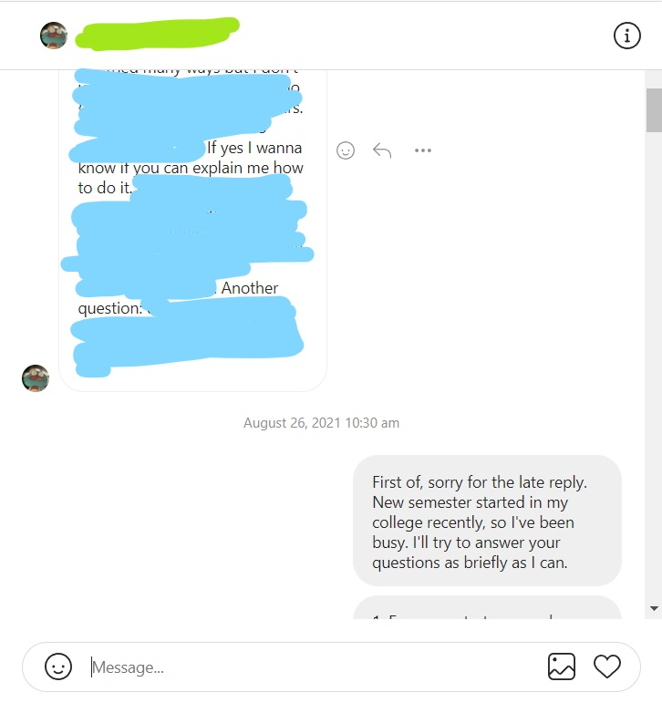
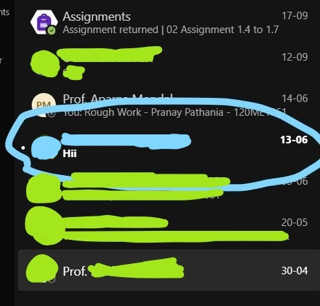

## **Generic Information**

I'm Pranay Pathania, an engineering student at NIT Rourkela, India. I got into programming on December 2020. Currrently, I am learning Web Development, focusing more on the frontend (I say that as I am reminded of my horrible times with CSS). 

 

**Some points about me regarding communication**:
1. I am fluent in English and Hindi (and a bit of Japanese).
2. I'm a team player, when forced to do so.
3. I'll do the work, you do the presentations, please (*looks at you with hope*)
4. Don't expect small talk from me. Yes, I've been the stereotypical quiet kid at school (minus the MP5). I have basically zero social skills and I'm not working on it (same reason why I don't have my face as the profile picture). This is excused for my friends, if they exist in the future (acquaintances and people on social platforms don't count).
5. I expect anyone who contacts me to give me feedback and/or criticism, or raise a question, or anything close to those things, instead of sending a simple "Hi". You'll just trigger my anxiety and never get a reply.

**Other random points**:
1. I play Warframe, Call of Duty:Mobile and Asphalt 9 (RIP Asphalt 8). Multiplayer on PC is a no-go because the ping I get is god-awful.
2. Apart from Web Dev, I have also worked with the following sofware:
    - AutoCAD
    - SOLIDWORKS
    - Blender
    - Unreal Engine 4 (this one needs more of my attention though, college work is hitting me hard)
3. I have been able to google the solutions to all the issues I've run into so far while building web apps (I heard it's important).

 

---

 

## **Languages/Technologies I am comfortable with**
- **C++** (my starting language; used only for DSA and general programming)
- **C** (same purpose as C++, and yes, I know they are different languages)
- **HTML** (really?)
- **CSS** (but need to work on making responsive websites)
- **JavaScript** (as long as things make sense)
- **React** (a LIBRARY, not a FRAMEWORK, as I have learnt)
- **TypeScript** (so much better than JS, seriously)
- **MongoDB** (if it is not considered a technology, I'll remove it from the list)

 

---

 

## **Languages/Technologies/Other Things I plan to learn in the future**
- **Vim** (heard it makes you look cool as a programmer)
- **Python (and PyGame)**
- **SQL** (and other things related to it)
- **GraphQL** (I heard it's good)

 

---

 

## **Contact me on other platforms**
- **Reddit**: [u/PranayPathania](https://www.reddit.com/user/PranayPathania)
- **Gmail**: pranaypathaniafeliks5.66@gmail.com
- **Facebook**: [Pranay Pathania](https://www.facebook.com/pranay.pathania1/)
- **Instagram**: [justanothertoxin](https://www.instagram.com/justanothertoxin/)

 

**Note**: If anyone ever feels like messaging me, DO NOT send "Hi" and expect a response. I'm a socially anxious introvert and have no way to reply to your "Hi", nor make any form of small talk. Tell me your question or give me some feedback, and I'll reply at the earliest. 

 

### **How to contact me for best replies**

 

 
 

### **How NOT to contact me**

 

 
 

### Sincerely, Pranay
---

<!--
**pranay-pathania/pranay-pathania** is a ✨ _special_ ✨ repository because its `README.md` (this file) appears on your GitHub profile.

Here are some ideas to get you started:

- 🔭 I’m currently working on ...
- 🌱 I’m currently learning ...
- 👯 I’m looking to collaborate on ...
- 🤔 I’m looking for help with ...
- 💬 Ask me about ...
- 📫 How to reach me: ...
- 😄 Pronouns: ...
- ⚡ Fun fact: ...
-->
